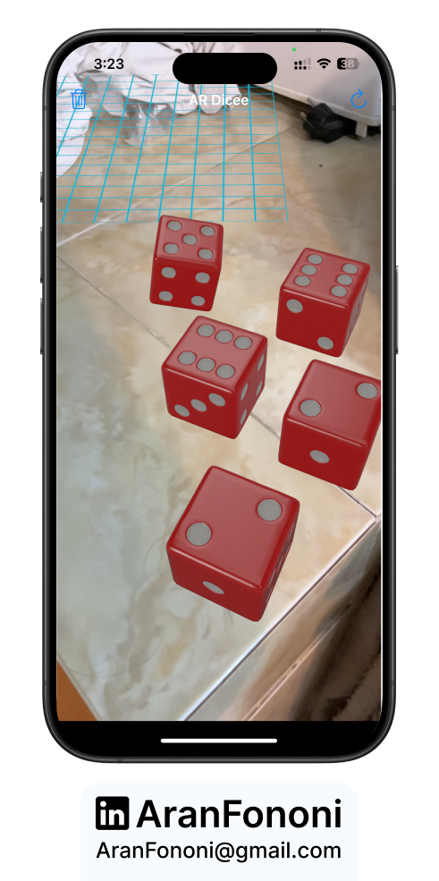
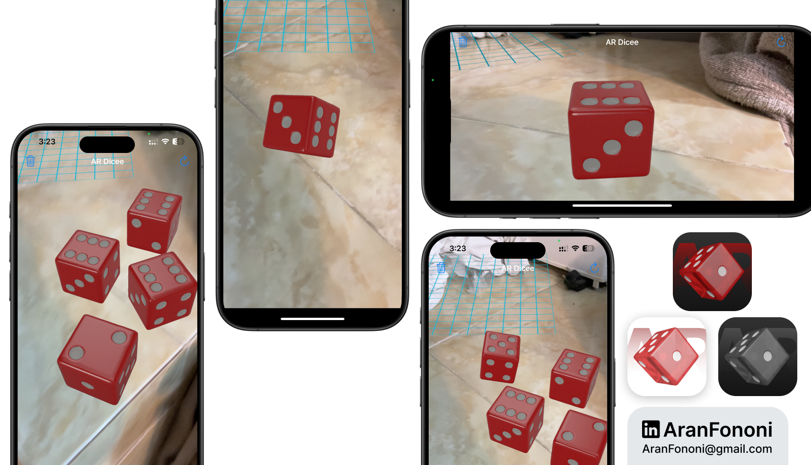

# ARDICEE 🎲

### Project for Section 27: **Augmented Reality Dice Roller with ARKit**

ARDICEE is an interactive AR-based dice roller that uses **ARKit** and **SceneKit** to bring virtual dice into the real world. This app leverages a high-quality 3D dice model in **USDZ** format, giving users a realistic and immersive experience as they roll dice on detected surfaces.

## Project Overview
The **ARDICEE** app detects flat surfaces in the environment, where users can tap to place and roll 3D dice. Dice are rolled either by tapping a button or by physically shaking the device, enhancing the tactile interaction. Built with ARKit, this project explores plane detection, 3D object manipulation, and custom action animations.

## What I Learned
This project provided hands-on experience with:
- **ARKit Basics**: Creating an interactive AR experience using plane detection and positioning 3D objects within real-world coordinates.
- **SceneKit**: Utilizing SceneKit to display and animate 3D dice models in real-time.
- **USDZ Model Integration**: Incorporating a high-quality 3D model format (USDZ) for optimized, realistic visuals.
- **Motion Detection**: Using device motion to trigger events, adding a dynamic element to the app’s interaction.

## Key Skills
- Surface detection and object placement with ARKit
- Custom animations with SceneKit
- Integrating USDZ 3D models for enhanced visuals
- Device motion-based actions for interactive control

## Additional Features
- **Shake-to-Roll**: Allows users to shake their device to roll all dice, making the experience more engaging.
- **Remove All Dice Option**: A toolbar button that clears all placed dice from the scene.
- **Enhanced Lighting**: Automatic lighting adjustments enhance the 3D dice rendering.

---

### Project Preview

---

### Footer

---

## Contact
For more information, feel free to reach out:  
- **Email**: [aranfononi@gmail.com](mailto:aranfononi@gmail.com)  
- **LinkedIn**: [Aran Fononi](https://www.linkedin.com/in/aran-fononi-18182b265)
